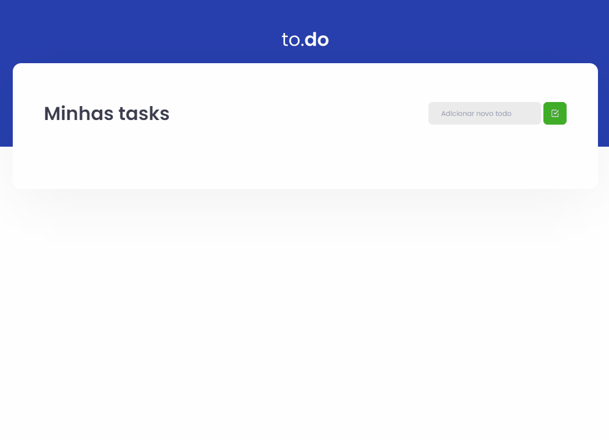

<h1 align="center">

  <br>
  <br>
    Chapter 1 - Desafio Principal
</h1>

<h4 align="center">
  Conceitos do React
</h4>

<p align="center">
  <a href="https://www.linkedin.com/in/rafael-martins92/">
    
  </a>

  

  
</p>

<p align="center">
Nesse desafio, criei uma aplicação (to-do list) para treinar o que aprendi até agora no ReactJS
</p>

<p align="center">
  <a href="#-sobre-o-projeto">Sobre o projeto</a>&nbsp;&nbsp;&nbsp;|&nbsp;&nbsp;&nbsp;
  <a href="#-tecnologias-utilizadas">Tecnologias utilizadas</a>&nbsp;&nbsp;&nbsp;|&nbsp;&nbsp;&nbsp;
  <a href="#ℹ️-Como-utilizar">Como utilizar</a>&nbsp;&nbsp;&nbsp;
</p>



## 📜 Sobre o projeto

Nesse desafio, criei uma aplicação (to-do list) para treinar o que aprendi até agora no ReactJS. Essa aplicação tem como o seu principal objetivo uma pequena aplicação de atividades a fazer, para treinar um pouco mais sobre manipulação de estado no React.

- Adicionar uma nova tarefa
- Remover uma tarefa
- Marcar e desmarcar uma tarefa como concluída

Este Desafio visa o aprendizado com ReactJS e TypeScript.

## 🚀 Tecnologias utilizadas

- [ReactJS](https://pt-br.reactjs.org/)
  - [SASS](https://sass-lang.com/)
  - [Webpack](https://webpack.js.org/)
- [localStorage API](https://developer.mozilla.org/en-US/docs/Web/API/Window/localStorage)
- [TypeScript](https://www.typescriptlang.org/)

## ℹ️ Como utilizar

### Instalando Dependências

```bash
    # Instalar as dependências
    $ yarn
```

### Iniciando aplicação

```bash
    # Iniciando aplicação
    $ yarn dev

    # A aplicação será aberta na porta:8080 - Basta acessar: http://localhost:8080/
```

<h4 align="center">
    Made with 💜 by Renato Xavier
</h4>
